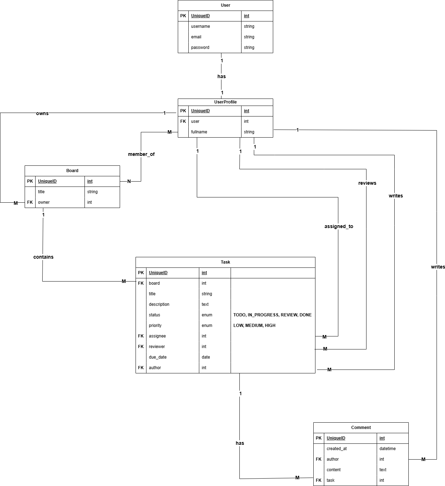
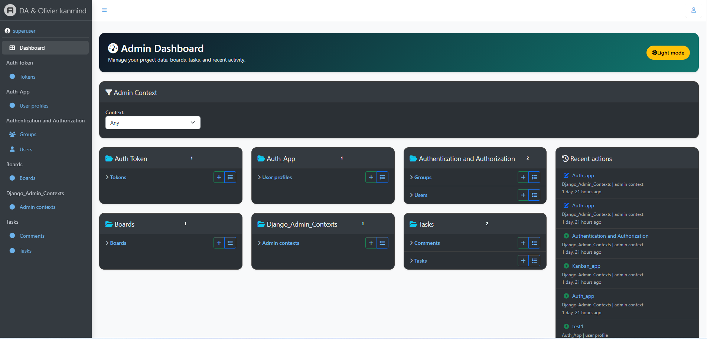
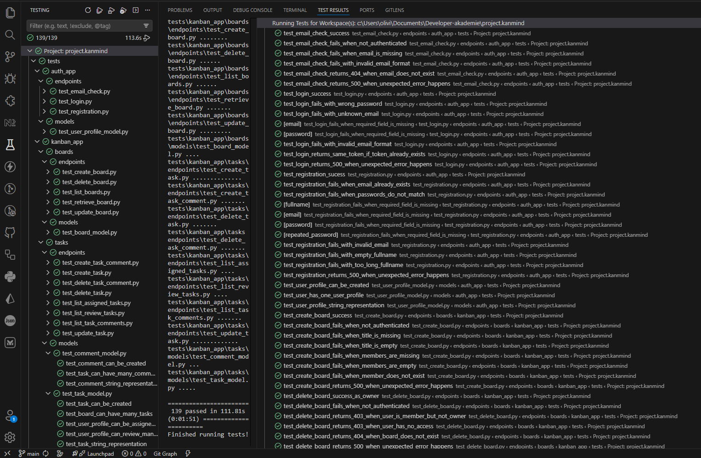

# 🧠 KanMind API


A modern Kanban-style task management API built with Django REST Framework.
KanMind provides authentication, board management, task workflows, and comment collaboration through a clean RESTful API architecture.

---

## 🚀 Features

- 🔐 User registration and login
- 🎫 Token-based authentication
- 📋 CRUD operations for Kanban boards
- ✅ Task management with statuses and priorities
- 👥 Board members and ownership system
- 💬 Task comments and collaboration
- 👀 Personalized task views:
  - Assigned tasks
  - Review tasks

- ⚙️ DRF-powered REST API architecture

---

## 📦 Setup

### Requirements

- Python 3.10+
- pip / virtualenv
- SQLite (default)
- Pytest
- Optional: Postman

---

### Local Installation

```bash
git clone https://github.com/Olivierentwicklung/project.kanmind.git

python -m venv .venv

# Linux / macOS
source .venv/bin/activate

# Windows
.venv\Scripts\activate

pip install -r requirements.txt

cp .env.template .env
     - Open the new .env file and replace the placeholders with your actual local secrets.

python manage.py migrate

pytest

python manage.py runserver
```

---

## 🧪 Example Usage

- Get the Django administration in Browser

  ```bash
   In Browser: http://127.0.0.1:8000/admin/
  ```

- Superuser credentials

  ```bash
   Username: superuser
   Password: a
  ```

---

## 🔐 Authentication Endpoints

| Method | Endpoint             | Description              |
| ------ | -------------------- | ------------------------ |
| POST   | `/api/registration/` | Register a new user      |
| POST   | `/api/login/`        | Login and receive token  |
| GET    | `/api/email-check/`  | Check email availability |

### Authentication Header

Authenticated requests require:

```http
Authorization: Token <your_token>
```

---

## 📋 Board Endpoints

| Method | Endpoint                  | Description        |
| ------ | ------------------------- | ------------------ |
| GET    | `/api/boards/`            | List all boards    |
| POST   | `/api/boards/`            | Create a new board |
| GET    | `/api/boards/{board_id}/` | Retrieve a board   |
| PATCH  | `/api/boards/{board_id}/` | Update a board     |
| DELETE | `/api/boards/{board_id}/` | Delete a board     |

---

## ✅ Task Endpoints

| Method | Endpoint                                      | Description           |
| ------ | --------------------------------------------- | --------------------- |
| GET    | `/api/tasks/assigned-to-me/`                  | Get assigned tasks    |
| GET    | `/api/tasks/reviewing/`                       | Get review tasks      |
| POST   | `/api/tasks/`                                 | Create a new task     |
| PATCH  | `/api/tasks/{task_id}/`                       | Update a task         |
| DELETE | `/api/tasks/{task_id}/`                       | Delete a task         |
| GET    | `/api/tasks/{task_id}/comments/`              | List task comments    |
| POST   | `/api/tasks/{task_id}/comments/`              | Create a task comment |
| DELETE | `/api/tasks/{task_id}/comments/{comment_id}/` | Delete a task comment |

---

## 🧾 Example Request

### Register User

```json
{
  "fullname": "Example User",
  "email": "example@mail.com",
  "password": "examplePassword",
  "repeated_password": "examplePassword"
}
```

---

## 🗂️ Project Structure

```text
project.kanmind/
├── manage.py
├── core/
│   ├── __init__.py
│   ├── settings.py
│   ├── urls.py
│   ├── asgi.py
│   └── wsgi.py
│
├── auth_app/
│   ├── __init__.py
│   ├── models.py
│   ├── admin.py
│   └── api/
│       ├── serializers.py
│       ├── views.py
│       ├── urls.py
│       └── permissions.py
│
├── kanban_app/
│   ├── __init__.py
│   ├── boards/
│   │   ├── models.py
│   │   ├── admin.py
│   │   └── api/
│   │       ├── serializers.py
│   │       ├── views.py
│   │       ├── urls.py
│   │       └── permissions.py
│   │
│   └── tasks/
│       ├── models.py
│       ├── admin.py
│       └── api/
│           ├── serializers.py
│           ├── views.py
│           ├── urls.py
│           └── permissions.py
│
├── tests/
│   ├── __init__.py
│   ├── conftest.py
│   ├── auth_app/
│   │   ├── __init__.py
│   │   ├── models/
│   │   │   ├── __init__.py
│   │   │   ├── test_user_profile_model.py
│   │   │
│   │   └── endpoints/
│   │       ├── __init__.py
│   │       ├── test_registration.py
│   │       ├── test_login.py
│   │       └── test_email_check.py
│   │
│   └── kanban_app/
│       ├── __init__.py
│       ├── boards/
│       │   ├── __init__.py
│       │   ├── conftest.py
│       │   ├── models/
│       │   │   ├── __init__.py
│       │   │   └── test_board_model.py
│       │   │
│       │   └── endpoints/
│       │       ├── __init__.py
│       │       ├── test_list_boards.py
│       │       ├── test_create_board.py
│       │       ├── test_retrieve_board.py
│       │       ├── test_update_board.py
│       │       └── test_delete_board.py
│       │
│       └── tasks/
│           ├── __init__.py
│           ├── conftest.py
│           ├── models/
│           │   ├── __init__.py
│           │   ├── test_task_model.py
│           │   └── test_comment_model.py
│           │
│           └── endpoints/
│               ├── __init__.py
│               ├── test_create_task.py
│               ├── test_update_task.py
│               ├── test_delete_task.py
│               ├── test_list_assigned_tasks.py
│               ├── test_list_review_tasks.py
│               ├── test_list_task_comments.py
│               ├── test_create_task_comment.py
│               └── test_delete_task_comment.py
│
├── pytest.ini
└── requirements.txt
```

---

## 🧠 ERD Overview

### Core Entities

- User
- UserProfile
- Board
- Task
- Comment

### Relationships

```text
User 1 ─── 1 UserProfile

UserProfile 1 ─── many Board
as owner

UserProfile many ─── many Board
as members

Board 1 ─── many Task

UserProfile 1 ─── many Task
as author

UserProfile 1 ─── many Task
as assignee

UserProfile 1 ─── many Task
as reviewer

Task 1 ─── many Comment

UserProfile 1 ─── many Comment
as author
```

---

**🎥 Demo:**

#### ERD



#### Admin Panel



#### Tests results WIP 1



---

## 🔒 Security

- Token-based authentication
- Protected API endpoints
- Permission-based board and task access
- User-specific task filtering

---

## 🧑‍💻 Tech Stack

- Python
- Django
- Django REST Framework
- DRF Token Authentication
- DRF with Pytest
- SQLite (default)

---

## ✨ Purpose

KanMind was designed as a modern backend project for practicing:

- Django REST Framework architecture
- Modular app design
- Authentication systems
- ERD and relational modeling
- RESTful API development
- TDD
- Kanban workflow concepts
